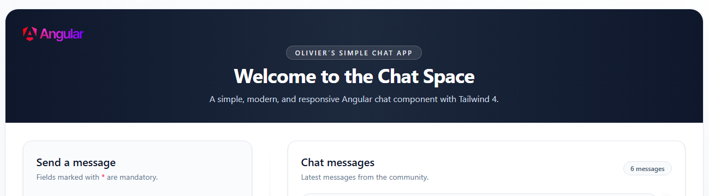

# 🚀 Chat App (Django API + External Frontend: Angular)

Provides a **JSON API** built with Django, consumed by an external frontend using Angular 21.

**Key concepts:**

- Django models & views & urls
- DB SQLite3
- Building API endpoints
  - GET: Get all chat messages
  - POST: Save a message
- JSON responses
- Check API endpoints with Postman
- Angular Frontend integration with HttpClient

**🎥 Demo:**

---

➡️ [View Main README](/README.md)
