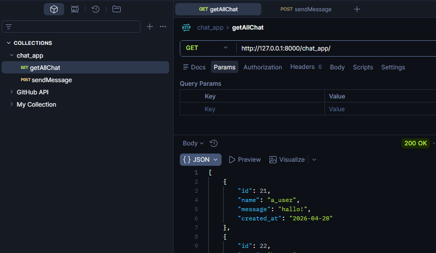
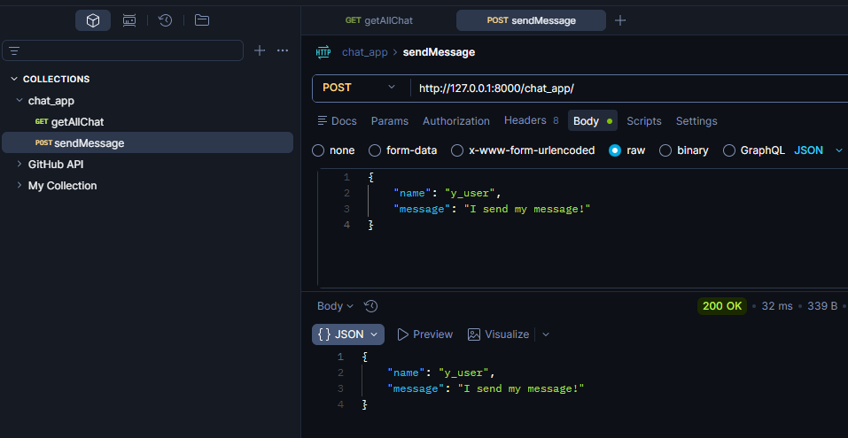
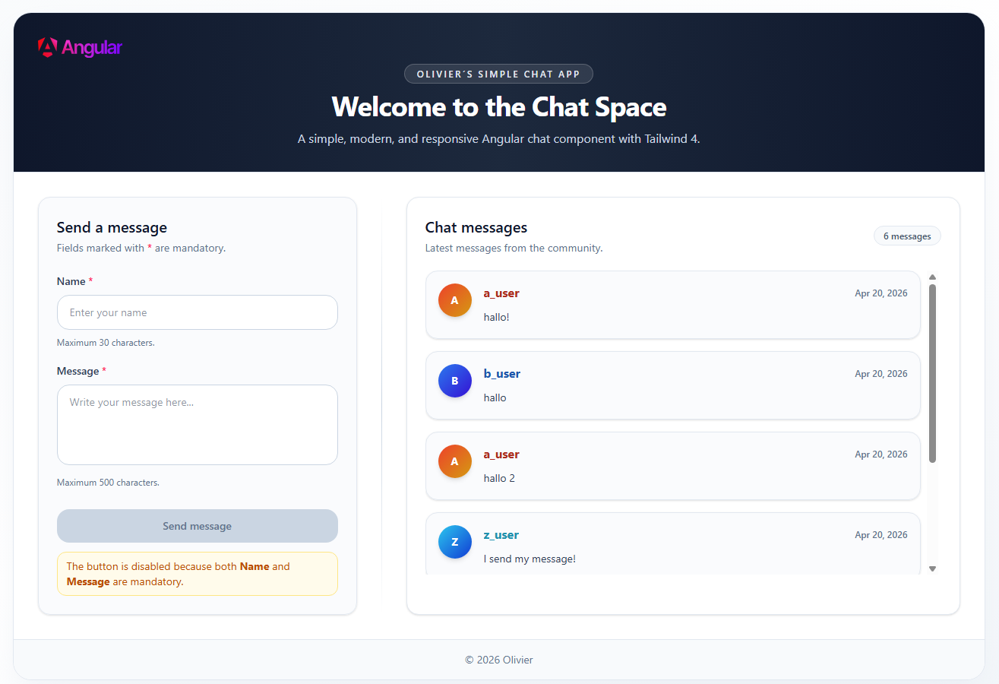

# 🚀 Chat App (Django API + External Frontend: Angular + Postman)

Provides a **JSON API** built with Django, consumed by an external frontend using Angular 21 + Postman.

## ⚙️ Features

- Displays a list of chat Messages from `db.sqlite3`
- Save a chat message to `db.sqlite3`
- A chat message should have:
  - name
  - message
  - created_at

## 🧪 Example Usage

- Send GET and POST requests through the API endpoint

  ```bash
  external frontend: http://127.0.0.1:8000/chat_app/

  ```

---

## ⚙️ Run external Frontend

```bash
Open another terminal:
  1. cd chat_app_external_frontend
  2. npm install
  3. npm start
  4. Open in browser: http://localhost:4200/
```

---

## 🧠 What I Learned

- How to create a model class
- How to add constraints to each field
- How to use `makemigrations` and `migrate`
- How to read data from `db.sqlite3`
- How to delete field content in the terminal
- How to use `request.method == "GET"`
- How to use `json.loads(request.body)`
- How to use `request.method == "POST"`
- How to use `.objects.all().values()`
- How to use `.save()`

---

## 🛠️ Tech Details

**Key concepts:**

- Django models & views & urls
- DB SQLite3
- Building API endpoints
  - GET: Get all chat messages
  - POST: Save a message
- JSON responses
- Check API endpoints with Postman
- Angular Frontend integration with HttpClient

---

**🎥 Demo:**

- Backend (Postman)
  - GET

    

  - POST

    

- Frontend (Angular 21)

  

---

## 🚀 Future Improvements

- How to DELETE, PUT, PATCH API endpoint

---

➡️ [View Main README](/README.md#-chat-app-django-api--external-frontend-angular--postman)
