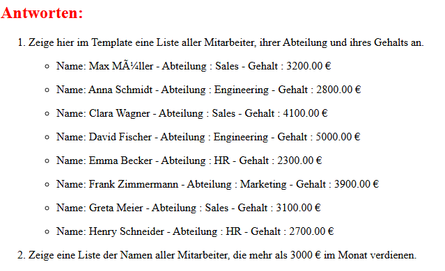

# 🚀 Staff Filter App (Django Templates)

In this exercise, i create filters in a Django app to display employee data based on specific criteria.

## ⚙️ Features

- Display a list of all employees, their department, and their salary in the template.
- Display a list of the names of all employees who earn more than €3000 per month.
- How many employees earn €5000 per month or more?
- What is the average salary of all employees in the Sales team? Display the result rounded to two decimal places.
- Which employees were hired before January 1, 2022 and do NOT belong to the HR department?

## 🧪 Example Usage

- Get the app in Browser

  ```bash
   In Browser: http://127.0.0.1:8000/employees/
  ```

---

## 🧠 What I Learned

- How to use `.objects.select_related`
- How to use `.filter`:
  - `__gt`
  - `__gte`
  - `Avg`
  - `Q`
  - `round()`

---

## 🛠️ Tech Details

**Key concepts:**

- Django views & urls
- Template rendering
- Server-side rendering

**🎥 Demo:**



---

## 🚀 Future Improvements

- Improve UI with CSS framework

---

➡️ [View Main README](/README.md#-staff-filter-app-django-templates)
