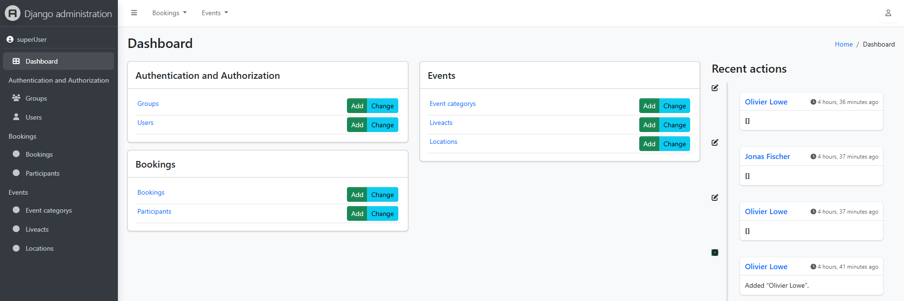

# 🚀 Django Admin - Event_Booking_System

In this exercise, we’ll focus on understanding and customizing the Django admin panel for an event booking system.

## ⚙️ Features

-> [Event_Booking_System requirements](https://hackmd.io/@mtUtNKDMTzWHLKW5U9RnOw/HJkzyJCRxe)

---

## 🧪 Example Usage

- Get the Django administration in Browser

  ```bash
   In Browser: http://127.0.0.1:8000/admin/
  ```

- Superuser credentials

  ```bash
   Username: superUser
   Password: password01
  ```

---

## 🧠 What I Learned

- How to create a `superuser`
- How to register models in the admin
- How to display model fields
- How to hide model fields
- How to use search functionalities
- How to use filtering functionalities
- How to use `fieldsets`
- How to use `date_hierarchy`
- How to rename models and fields
- How to display fields as read-only in the admin panel
- How to pre-fill fields
- How to use `django-jazzmin`

---

## 🛠️ Tech Details

**Key concepts:**

- Django Admin Dashboard
- Registering models in the admin
- adding filter functions
- Arranging fields, and other admin customizations
- Customizing Django Admin Dashboard With Jazzmin

**🎥 Demo:**



---

## 🚀 Future Improvements

- Registering all models in the admin
- Advanced UI styling

---

➡️ [View Main README](/README.md#-django-admin---event_booking_system)
