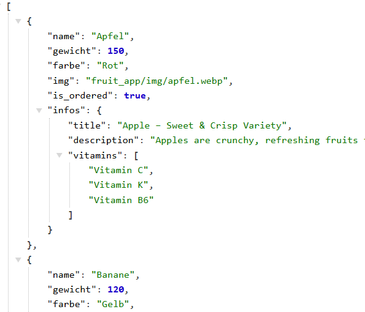
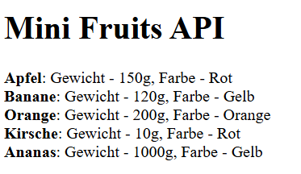

# 🚀 Fruit App 1

Provides a **JSON API** built with Django, consumed by an external frontend using JavaScript.

## ⚙️ Features

- Displays a list of fruits

---

## 🧪 Example Usage

- Get the list of fruits

  ```bash
   In external frontend: http://localhost:8000/fruits/
  ```

---

## ⚙️ Run external Frontend

```bash
open with live server: fruit_app_external_frontend/index.html
```

---

## 🧠 What I Learned

- Backend:
  - How to use `HttpRequest` and `JsonResponse` in `views.py`
  - How to configure `CORS_ALLOWED_ORIGINS`

- External Frontend
  - How to fetch data from a GET API endpoint
  - How to separate HTML and JavaScript files
  - How to automatically render HTML when the page loads
  - How to display an array in HTML

---

## 🛠️ Tech Details

**Key concepts:**

- Building API endpoints
- JSON responses
- Frontend integration with Fetch API

**🎥 Demo:**

- Backend

  

- Frontend

  

## 🚀 Future Improvements

- How to fetch data from a POST, DELETE, PUT, PATCH API endpoint
- Improve UI with CSS framework

---

➡️ [View Main README](/README.md#-fruit-app-1-api--external-frontend)
