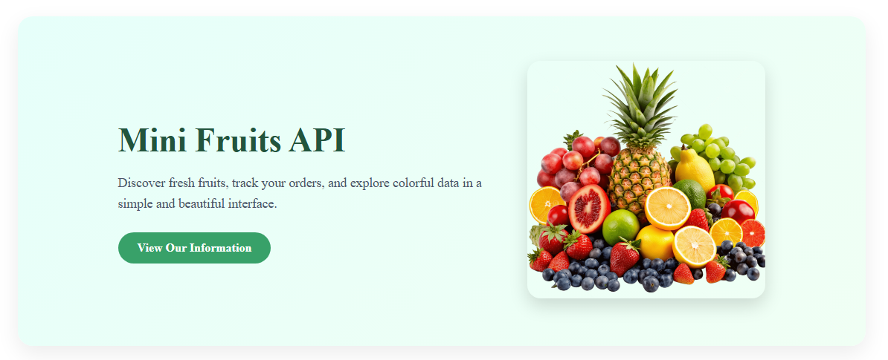

# 🚀 Fruit App 2

Displays a list of fruits using **Django Templates** and a **list of dictionnaries**.

**Key concepts:**

- Django views & urls
- Template rendering
- Reusable templates
- Navigation between templates
- Main 404 template
- Server-side rendering

**🎥 Demo:**

---

➡️ [View Main README](/README.md)
