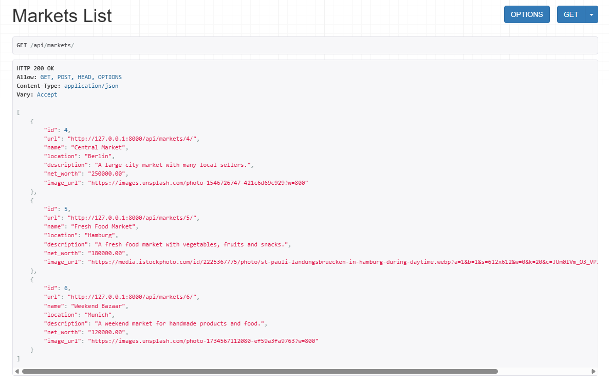

# 🚀 Market Management Application

In this exercise, i build a full-stack application to manage:

- Markets
- Sellers
- Products

## ⚙️ Features

- Create, update, delete, and view Markets
- Create, update, delete, and view Sellers
- Create, update, delete, and view Products
- Assign sellers to one or multiple markets (Many-to-Many relationship)
- Assign each product to a specific market and seller (ForeignKey relationships)
- Display a list of all markets with their details (name, location, description, net worth, image)
- Display all sellers belonging to a specific market
- Display all products available in a specific market
- Display all products created by a specific seller
- Show detailed views for markets, sellers, and products
- Upload or display images for markets, sellers, and products
- Fetch and display data from the Django REST API in Angular
- Implement API endpoints for all entities (CRUD operations)
- API endpoints using Postman or DRF API Browser
- Build reusable Angular services for API communication
- Use Angular components to display lists and detail views

## 🧪 Example Usage

- Populate example db content

  ```bash
   In Terminal: python manage.py seed_market_app
  ```

- Send GET and POST requests through the API endpoint

  ```bash
  external frontend: http://127.0.0.1:8000/api/
    - markets
    - sellers
    - products

  ```

---

## ⚙️ Run external Frontend

```bash
Open another terminal:
  1. cd market_app_external_frontend
  2. npm install
  3. npm start
  4. Open in browser: http://localhost:4200/
```

---

## 🧠 What I Learned

- How to use `in serializers.py`
  - `serializers.ModelSerializer`
  - `serializers.HyperlinkedModelSerializer`
  - `inheritance `
- How to use `in views.py`:
  - `viewsets.ModelViewSet`
  - `MarketHyperlinkedModelSerializer`
- How to use `in urls.py`:
  - `from rest_framework import routers`
  - `routers.SimpleRouter()`

---

## 🛠️ Tech Details

**Key concepts:**

- Backend: Django + Django REST Framework
  - Testing: Postman + DRF API Browser
- Frontend: Angular

**🎥 Demo:**



---

## 🚀 Future Improvements

- Search products
- Filter by market/seller
- Form validation
- Pagination
- Authentication
- UI styling

---

➡️ [View Main README](/README.md#-market-management-application)
