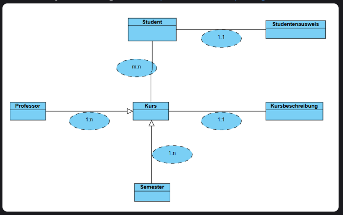

# 🚀 Modeling a University System with Django

Provides all **Class Models**.

**Key concepts:**

- Transform textual requirements into a relationship diagram
- From the relationship diagram, implement the corresponding class models

**🎥 Demo:**

---

➡️ [View Main README](/README.md#-modeling-a-university-system-with-django)
